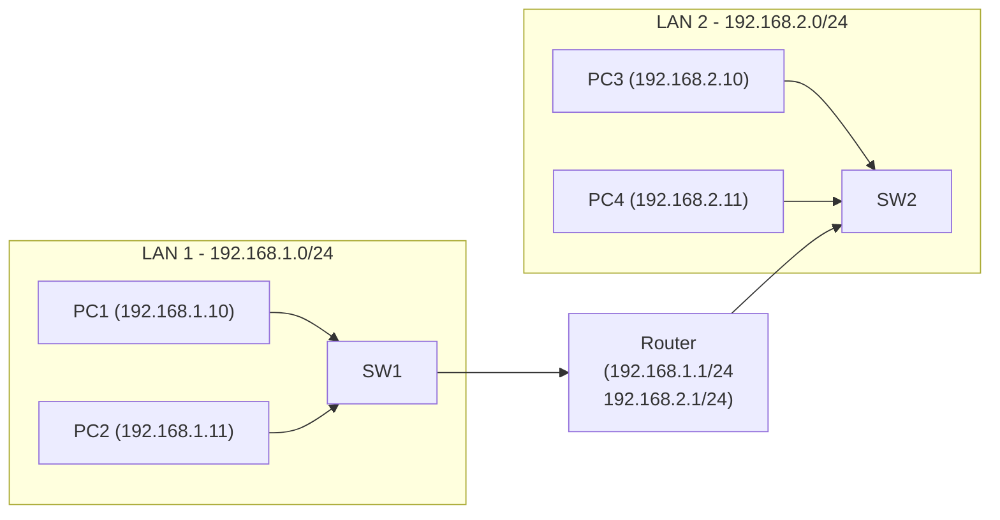

# 🏡 Small Home Network (Cisco Packet Tracer)

This is a simple Layer 2 + Layer 3 network topology built using **Cisco Packet Tracer**, intended to demonstrate basic IP addressing, routing, and switch-router communication.

---

## 🧱 Network Topology Overview

- **4 PCs** (end devices)
- **2 Switches** (Layer 2)
- **1 Router** (Layer 3)
- **Static IP addressing**
- **Routing between two subnets**
- **No DHCP or NAT in this version**

---

## 🔧 Configuration Summary

```
enable
configure terminal
interface FastEthernet0/0
ip address 192.168.1.1 255.255.255.0
no shutdown

interface FastEthernet0/1
ip address 192.168.2.1 255.255.255.0
no shutdown

interface FastEthernet1/0
ip address 192.168.3.1 255.255.255.0
no shutdown

interface FastEthernet1/1
ip address 192.168.4.1 255.255.255.0
no shutdown
end

```

| Device | IP Address     | Subnet Mask       | Gateway         |
|--------|----------------|-------------------|------------------|
| PC0    | 192.168.1.10   | 255.255.255.0     | 192.168.1.1      |
| PC1    | 192.168.1.11   | 255.255.255.0     | 192.168.1.1      |
| PC2    | 192.168.2.10   | 255.255.255.0     | 192.168.2.1      |
| PC3    | 192.168.2.11   | 255.255.255.0     | 192.168.2.1      |

Router interfaces:
- `Gig0/0` – 192.168.1.1
- `Gig0/1` – 192.168.2.1

---

## 🌐 Flowchart: Packet Flow


---

## 📆 Progress Log

### ✅ 21 June 2025 – Core Network Setup Complete
- Created a working 2-LAN architecture connected via router
- Configured static IPs and default gateways
- Set up inter-network routing using Gigabit interfaces on the router
- Verified connectivity across subnets using ping tests
- Created the first network flowchart diagram
- Planned upcoming phases: VLANs, ACLs, and firewall integration


---

## 🚀 How to Run

1. Download and install **Cisco Packet Tracer**
2. Clone this repository:
   ```bash
   git clone https://github.com/nethaxstark/
